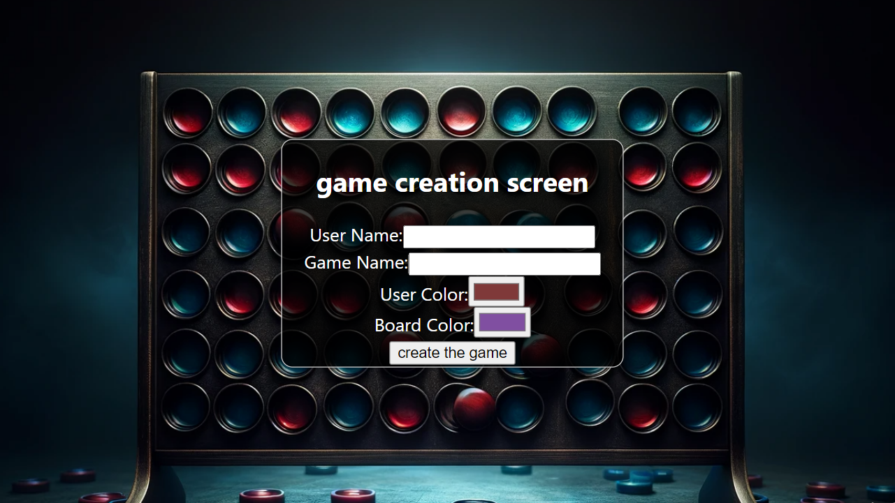

# Connect Four Game

Welcome to the Connect Four game project! This is a simple yet engaging game where you can play against the computer. The project consists of three screens: 

- Game Creation Screen
- Game List Screen
- Game Screen

## Screens

### 1. Create Game Screen

This screen allows the user to set up a new game. Here, the user needs to input their username and choose a game name. Additionally, the user can select their preferred color and board color. The entered data is stored in the localStorage for use in the subsequent screens.

### 2. Game List Screen

In this screen, the project lists the details of each player stored in the localStorage. Users can view their past game information and make informed decisions about their next moves.

### 3. Game Screen

The heart of the project lies in the Game Screen, where the Connect Four game board is displayed. The current player's turn is highlighted, and the winner is announced when a player succeeds. The page is refreshed if the game ends in a draw.

## Features

- Create a new game with customizable options.
- List and view the history of played games.
- User-friendly interface with visually appealing game board and controls.
- Real-time updates on game results and winner announcements.

## How to Play
Navigate to the Create Game Screen and enter your username and game name.
Choose your preferred colors for the player and the board.
Proceed to the Game List Screen to review past game information.
Start a new game or resume an existing one from the list on the Game List Screen.
Enjoy playing Connect Four on the Game Screen!

Feel free to contribute to the project or report any issues. Happy gaming!

## Project Details

- **Prompt Engineering System:** The game is developed using the prompt engineering system, and a robust algorithmic logic ensures a challenging gaming experience. This is a no-code project.

- **Technology:** The project is implemented as a React application. To start the project, run the following commands:

## Credits

- [OpenAI](https://www.openai.com/) - Used GPT-3.5 language model for code generation.
